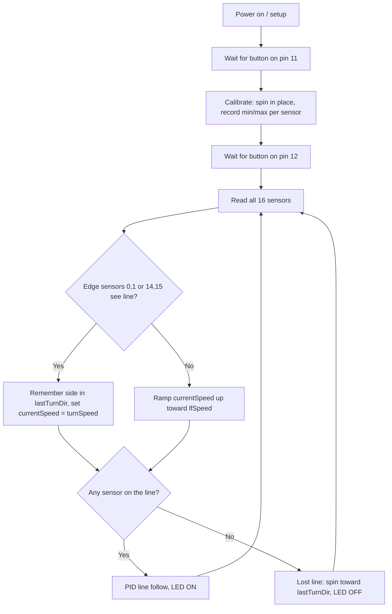

# FLF-TECHNOXIAN
PID line follower for a robot (16-ch analog sensor, TB6612FNG) with turn speed control for sharp 90° turns and lost-line recovery
# FLF-TECHNOXIAN

PID line follower firmware for the **LF-2 robot** with a **16-channel analog sensor array** and a **TB6612FNG motor driver**, tuned for sharp 90° turns.

It adds three things on top of a basic PID follower:

- **Turn speed**: the robot slows down automatically when the line reaches the edge sensors (a sharp turn is coming).
- **Soft-start ramp**: speed climbs gradually back to full after a start or a turn.
- **Reliable lost-line recovery**: if the robot runs off the line at a corner, it always spins toward the side where the line was last seen instead of driving straight on.

---

## Quick start

1. Open `FLF_TECHNOXIAN/FLF_TECHNOXIAN.ino` in the Arduino IDE.
2. Select your board (Arduino Nano / Uno, ATmega328P) and port, then upload.
3. Place the robot on the track, sensor bar over the line.
4. Press the **button on pin 11**. The robot spins in place for a few seconds to calibrate the sensors.
5. Press the **button on pin 12**. After 1 second the robot starts following the line.

The **LED on pin 13** is ON while the robot sees the line and OFF while it is searching for it.

---

## Hardware

| Part | Details |
|---|---|
| Controller | ATmega328P board (Arduino Nano / Uno) |
| Motor driver | TB6612FNG |
| Sensor | 16-channel analog array read through a 16:1 multiplexer |
| Inputs | 2 push buttons (calibrate, start) |
| Output | Status LED |

### Pinout

| Function | Pin |
|---|---|
| Motor A direction (AIN1 / AIN2) | D4 / D3 |
| Motor A speed (PWMA) | D9 |
| Motor B direction (BIN1 / BIN2) | D6 / D7 |
| Motor B speed (PWMB) | D10 |
| Motor driver standby (older boards) | D5 (held HIGH) |
| Mux select lines s0, s1, s2, s3 | A0, A1, A2, A3 (D14 to D17) |
| Mux analog output | A4 |
| Calibrate button | D11 (INPUT_PULLUP) |
| Start button | D12 (INPUT_PULLUP) |
| Status LED | D13 |

On newer carrier boards with a motor-enable jumper, the two lines that drive pin 5 in `setup()` can be removed to free up D5.

---

## Workflow



---

## How it works

### 1. Calibration

The robot spins in place (`motor1run(70)`, `motor2run(-70)`) for 3000 loop cycles so every sensor passes over both the line and the background. For each sensor it records the lowest and highest reading. These are later used to normalise the raw values, so the code works on different surfaces and lighting. The midpoint thresholds are printed to the Serial Monitor at 115200 baud.

### 2. Reading the sensors

`sensorRead(i)` sets the four multiplexer select pins to the binary value of `i` and reads the selected sensor on A4. The ADC prescaler is set to 16 in `setup()` so that all 16 readings are fast.

`readLine()` then maps each reading to a 0 to 1000 scale using the calibration values (flipped if `isBlackLine` is 0 for a white line). A sensor with a value above 500 counts as "on the line". If at least one sensor is on the line, `onLine` is 1.

### 3. Calculating the error

Each sensor has a weight, from +7 on one edge to -7 on the other, with the two centre sensors at 0:

```
sensor: 0  1  2  3  4  5  6  7  8  9  10  11  12  13  14  15
weight: 7  6  5  4  3  2  1  0  0 -1  -2  -3  -4  -5  -6  -7
```

The error is the weighted average of the active sensors. It is 0 when the line is centred, large and positive when the line is toward sensor 0, and large and negative when it is toward sensor 15.

### 4. PID steering

```
PIDvalue = Kp * error + Ki * (sum of errors) + Kd * (change in error)
left  = currentSpeed - PIDvalue
right = currentSpeed + PIDvalue
```

Both wheels share a forward base speed, `currentSpeed`. The PID value is subtracted from one wheel and added to the other, so the difference between them steers the robot back onto the line. Wheel speeds are limited to the range -100 to 255.

### 5. Speed control: lfSpeed, currentSpeed and turnSpeed

| Variable | Meaning |
|---|---|
| `lfSpeed` | Target top speed on straights and gentle curves |
| `currentSpeed` | The actual base speed being used right now |
| `turnSpeed` | Reduced base speed used at sharp turns |

`currentSpeed` starts at 150 and increases by 1 each loop until it reaches `lfSpeed`. When the edge sensors (0, 1, 14 or 15) see the line, a sharp turn is coming, so `currentSpeed` drops to `turnSpeed`. After the turn it ramps back up.

`turnSpeed` does not turn the robot by itself. It lowers the forward speed so the PID correction has a much bigger effect relative to it, which lets the robot make tight corners without overshooting.

### 6. Lost-line recovery

At a 90° corner the robot can run past the line so that no sensor sees it. While following, the code keeps track of which edge last saw the line in `lastTurnDir`:

- `1` means the line was last seen on the sensor 0 side.
- `-1` means the line was last seen on the sensor 15 side.

When the line is lost, the robot pivots toward that side (one wheel at -100, the other at 255) until a sensor finds the line again, and `currentSpeed` is reset to `turnSpeed` so it rejoins the line slowly. If neither edge ever saw the line, it falls back to the sign of the last error.

---

## Configuration

All of these are at the top of the sketch.

| Setting | Default | Effect |
|---|---|---|
| `isBlackLine` | 1 | 1 for a black line on white, 0 for a white line on black |
| `lfSpeed` | 200 | Top speed. Raise for faster straights |
| `currentSpeed` | 150 | Starting speed for the soft start |
| `turnSpeed` | 90 | Speed at sharp turns. Lower if it overshoots corners |
| `Kp` | 0.1 | How strongly it reacts to being off-centre |
| `Kd` | 1 | Damping. Raise if it wobbles or slides past turns |
| `Ki` | 0 | Integral term, usually left at 0 for line followers |

---

## Tuning tips

- **Overshoots 90° turns:** lower `turnSpeed` (try 70), or add sensors 2 and 13 to the turn detection so it brakes earlier.
- **Too slow on gentle curves:** remove sensors 1 and 14 from the turn detection so only the extreme edges trigger braking.
- **Wobbles on straights:** lower `Kp` or raise `Kd`.
- **Turns the wrong way when it loses the line:** swap the `1` and `-1` in the `lastTurnDir` block.
- **Drives straight through corners:** uncomment `printAdjValues();` in `readLine()`, turn the motors off, and slide the robot over the corner by hand while watching the Serial Monitor. If the edge sensors never go above 500, check calibration and sensor height.

---

## Project structure

```
FLF-TECHNOXIAN/
├── FLF_TECHNOXIAN/
│   └── FLF_TECHNOXIAN.ino   # Arduino sketch
└── README.md
```

The sketch sits in a folder with the same name because the Arduino IDE requires the `.ino` file and its folder to match.
